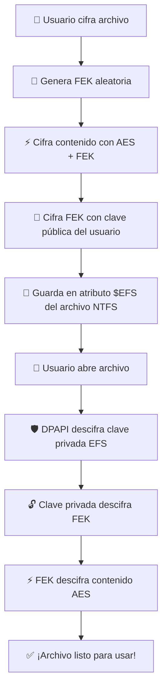

## 🔒 EFS Deep Dive: Cómo Windows Cifra Tus Archivos

> 💡 *"La magia está en la combinación de cifrado simétrico + asimétrico + DPAPI. ¡Vamos a destriparlo!"*

---

### 🔑 1. Cada archivo = su propia FEK (¡Nada de compartir!)

| Concepto | Detalle | Emoji-Clave |
|----------|---------|-------------|
| **FEK** | File Encryption Key: única, aleatoria y **por archivo** | 🎲 |
| **Algoritmo** | AES-256 (simétrico → rápido para datos grandes) | ⚡ |
| **Alcance** | Solo cifra **ese archivo**. Otro archivo = otra FEK | 📁➡️🎲 |

```text
📁 archivo_secreto.docx ───┐
                          ├─→ 🎲 FEK_aleatoria_A
📁 presupuesto.xlsx ──────┤
                          ├─→ 🎲 FEK_aleatoria_B
📁 foto_vacaciones.jpg ───┘
                          └─→ 🎲 FEK_aleatoria_C
```

---

### 🔐 2. La FEK se "envuelve" con claves públicas (¡Elegante y seguro!)

```text
🎲 FEK ───[cifra con]───→ 🔒 FEK⊗(pub_Alice)
                          │
                          ├─→ 🔒 FEK⊗(pub_Bob)    ← ¡Multi-usuario!
                          │
                          └─→ 🔒 FEK⊗(pub_DataRecoveryAgent)
```

> ✅ **Regla de oro**:  
> La FEK **nunca** se guarda en claro. Siempre viaja "envuelta" (`⊗`) en claves públicas de usuarios autorizados.

---

### 🗃️ 3. ¿Dónde vive cada cosa? (Mapa del tesoro NTFS)

```
┌──────────────────────────────────────────────────────────────┐
│  💾 DISCO (NTFS)                                             │
│  ┌──────────────────────────────────────────────────────┐   │
│  │ 📁 archivo_cifrado.txt                               │   │
│  │  ├─ 💎 $DATA          → contenido cifrado (AES)      │   │
│  │  └─ 🔐 $EFS           → FEK⊗(pub_Alice) + ...        │   │
│  └──────────────────────────────────────────────────────┘   │
└──────────────────────────────────────────────────────────────┘
                              │
                              ▼
┌──────────────────────────────────────────────────────────────┐
│  👤 PERFIL DE USUARIO (Windows Certificate Store)            │
│  ┌──────────────────────────────────────────────────────┐   │
│  │ 🔑 Certificado EFS de Alice                          │   │
│  │  ├─ 🌐 Clave pública  → cifra FEK                    │   │
│  │  └─ 🔒 Clave privada  → descifra FEK                 │   │
│  │        └─ [cifrada con] → 🛡️ DPAPI (ligada a password)│   │
│  └──────────────────────────────────────────────────────┘   │
└──────────────────────────────────────────────────────────────┘
```

> ⚠️ **¡Ojo!** Si pierdes tu cuenta de Windows (o no tienes backup del certificado), **¡adiós archivo!** 🔓 → 💀

---

### 🔄 4. Flujo completo: De clic a descifrado (paso a paso)



> 💡 **Bonus multi-usuario**:  
> Windows puede cifrar la **misma FEK** con múltiples claves públicas → un solo archivo, múltiples dueños legítimos 👥

---

### 🧠 Takeaways (para llevar)

| ✅ Sí | ❌ No |
|-------|-------|
| Cada archivo → su FEK única | La FEK se reutiliza entre archivos |
| FEK cifrada con clave **pública** | FEK guardada en claro |
| Clave privada protegida por **DPAPI** | Clave privada accesible sin contraseña |
| Multi-usuario = misma FEK + múltiples envoltorios | Cada usuario tiene su propia FEK |

---
