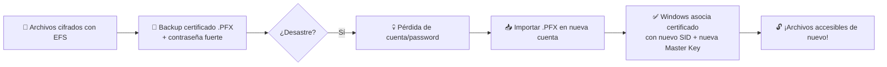

---

# 🔐 Trilogy of Trust: DPAPI, EFS & BitLocker  
*De ataques reales a defensas prácticas — todo en un solo lugar*

---

## 🩸 1. Diagrama de Ataque: Robo de Machine Keys desde Disco Frío

> ⚠️ **Advertencia:** Esto es para *defensa*, no para atacar sistemas ajenos. Conocer el ataque es la única forma de defenderse.

---

### 🧠 ¿Por qué las Machine Keys son el Santo Grial del atacante?

| Clave | Protegida por | Vulnerabilidad en disco frío |
|-------|---------------|------------------------------|
| **User Master Key** | Contraseña del usuario (KDF) | 🔒 Segura si el usuario tiene password fuerte |
| **Machine Master Key** | Clave del sistema (SYSTEM) | 💀 **Expuesta en disco sin cifrado de volumen** |
| **LSA Secrets** | DPAPI SYSTEM | 💀 Accesible si se extrae el SAM + SECURITY hive |

> 🎯 **Objetivo del atacante:** Extraer Machine Keys → descifrar DPAPI Blobs → obtener claves privadas EFS → acceder a archivos cifrados **sin conocer la contraseña del usuario**.

---

### 🗺️ Mapa del Tesoro: Dónde Vive la Machine Key en Disco

```
C:\\Windows\\System32\\Microsoft\\Protect\\
├── S-1-5-18\\                 ← SID de la cuenta SYSTEM
│   ├── Preferred            ← Apunta a la Master Key activa
│   └── {GUID}\\             ← Archivo binario de Master Key (¡cifrado pero con clave débil!)
│
└── S-1-5-19\\                 ← SID de LOCAL SERVICE
└── S-1-5-20\\                 ← SID de NETWORK SERVICE
```

> 💀 **Problema crítico:** La Machine Key se cifra con una clave derivada de:
> - `C:\\Windows\\System32\\config\\SECURITY` hive (LSA)
> - `C:\\Windows\\System32\\config\\SYSTEM` hive
> 
> **¡Ambos están en disco en claro si no hay BitLocker!**

---

### 🔪 Flujo de Ataque Paso a Paso (Disco Frío)

```mermaid
flowchart TD
    A[💾 Atacante extrae disco físico<br>o monta imagen forense] --> B[🔍 Localiza hives del sistema]
    B --> C[📁 Extrae SECURITY + SYSTEM hives]
    C --> D[🧪 Usa mimikatz/SharpDPAPI<br>para derivar SYSTEM DPAPI key]
    D --> E[🔓 Descifra Machine Master Key<br>desde S-1-5-18\\{GUID}]
    E --> F[🛡️ Usa Machine Key para descifrar<br>DPAPI Blobs de usuarios]
    F --> G[🔑 Obtiene claves privadas EFS<br>de %APPDATA%\\Microsoft\\Protect\\{SID}]
    G --> H[🔓 Descifra FEK desde $EFS<br>del archivo NTFS]
    H --> I[⚡ ¡Acceso total a archivos cifrados!]
```

---

### 💻 Comandos Reales del Atacante (para defensa)

```powershell
# 1. Extraer hives del sistema (desde Live CD/WinPE)
reg save HKLM\\SYSTEM C:\\forensic\\SYSTEM.hive
reg save HKLM\\SECURITY C:\\forensic\\SECURITY.hive

# 2. Derivar SYSTEM DPAPI key con mimikatz (offline)
mimikatz.exe "dpapi::system /in:SYSTEM.hive /sec:SECURITY.hive" exit

# 3. Descifrar Machine Master Key
mimikatz.exe "dpapi::masterkey /in:S-1-5-18\\{GUID} /system:{clave_derivada}" exit

# 4. Descifrar DPAPI Blob de un usuario (ej: clave privada EFS)
mimikatz.exe "dpapi::blob /in:blob.bin /masterkey:{GUID_descifrado}" exit
```

> 🔒 **Defensa efectiva:**  
> ✅ **BitLocker** (cifrado de volumen completo) → hives en disco cifrados  
> ✅ **TPM + PIN** → clave de BitLocker ligada a hardware + contraseña  
> ✅ **Nunca usar cuentas sin password** en dispositivos móviles  

---

### 🛡️ Checklist de Defensa contra Ataques de Disco Frío

| ✅ Acción | 📍 Dónde aplicar | 🔒 Impacto |
|-----------|------------------|-----------|
| Habilitar BitLocker con TPM+PIN | Política de grupo / `manage-bde -on C: -tpmpin` | 🔒🔒🔒 Máximo |
| Forzar password en todas las cuentas | `secpol.msc` → Cuentas de usuario | 🔒🔒 Alto |
| Restringir acceso físico al hardware | BIOS/UEFI password + chasis lock | 🔒 Medio |
| Auditoría de cuentas sin password | `net user` + script PowerShell | 🔒 Bajo (detecta riesgo) |

---

## 💾 2. Guía Paso a Paso: Backup & Restauración de Certificados EFS

> 💡 **Regla de oro:** Sin backup del certificado EFS = archivos cifrados = basura digital si pierdes tu cuenta. ¡Haz esto HOY!

---

### 📦 ¿Qué se guarda en el backup?

| Componente | ¿Se incluye en .PFX? | ¿Por qué importa? |
|------------|----------------------|-------------------|
| **Clave privada EFS** | ✅ Sí (si exportas con "Marcar como exportable") | Sin ella → imposible descifrar FEK |
| **Clave pública EFS** | ✅ Sí | Necesaria para cifrar nueva FEK |
| **Cadena de certificación** | ✅ Sí (si incluyes certificados intermedios) | Validación en entornos de dominio |
| **Master Key de DPAPI** | ❌ No | Se regenera al restaurar en nueva cuenta |

---

### 🔁 Flujo Visual: Backup → Catastrofe → Restauración



---

### 🛠️ Paso 1: Hacer Backup del Certificado EFS (GUI)

1. Presiona `⊞ Win + R` → escribe `certmgr.msc` → Enter
2. Navega a: **Certificados - Usuario actual** → **Personal** → **Certificados**
3. Busca certificados con:
   - **Campo "Intended Purposes"** = `Encrypted Data`
   - **Icono** = llave pequeña en esquina inferior izquierda 🔑
4. Click derecho → **Todas las tareas** → **Exportar...**
5. En el asistente:
   - ✅ **Sí, exportar la clave privada**
   - ✅ Formato **PKCS #12 (.PFX)**
   - ✅ **Marcar como exportable** (¡crítico!)
   - 🔒 Establece una **contraseña fuerte** para el .PFX (diferente de tu password de Windows)
6. Guarda en: **USB cifrado** o **almacenamiento offline seguro** (¡nunca en el mismo disco!)

---

### 💻 Paso 1 Alternativo: Backup con PowerShell (para admins)

```powershell
# Listar certificados EFS del usuario actual
Get-ChildItem Cert:\\CurrentUser\\My | Where-Object { $_.EnhancedKeyUsageList.FriendlyName -contains "Encrypted Data" }

# Exportar a .PFX (¡requiere ejecutar como el usuario dueño!)
$cert = Get-ChildItem Cert:\\CurrentUser\\My\\<THUMBPRINT>
Export-PfxCertificate -Cert $cert -FilePath "D:\\backup\\EFS_Backup_$(Get-Date -Format 'yyyyMMdd').pfx" -Password (Read-Host -AsSecureString "Contraseña .PFX")
```

> ⚠️ **¡Ojo!** El certificado solo puede exportarse **desde la cuenta que lo creó**. Si ya perdiste acceso → es demasiado tarde.

---

### 🔑 Paso 2: Restaurar Certificado EFS (GUI)

1. En la **nueva cuenta de Windows** (o después de resetear password):
2. `⊞ Win + R` → `certmgr.msc`
3. Click derecho en **Personal** → **Certificados** → **Todas las tareas** → **Importar...**
4. Selecciona tu archivo `.pfx`
5. Ingresa la **contraseña del .PFX** (no tu password de Windows)
6. Almacén de destino: **Personal**
7. ✅ **Marcar como exportable** (para futuros backups)
8. Finalizar → ¡Listo!

> ✅ **Verificación:** Abre un archivo cifrado con EFS → si se abre sin errores, ¡el restore funcionó!

---

### 💻 Paso 2 Alternativo: Restaurar con PowerShell

```powershell
# Importar .PFX a la cuenta actual
Import-PfxCertificate -FilePath "D:\\backup\\EFS_Backup_20240615.pfx" -CertStoreLocation Cert:\\CurrentUser\\My -Password (Read-Host -AsSecureString "Contraseña .PFX")
```

---

### 🧪 Paso 3: Verificar que Windows Reconoce el Certificado EFS

```cmd
cipher /u /n
```

> ✅ Salida esperada:  
> `Updating EFS certificate cache...`  
> `1 new certificate(s) installed.`

---

### 💀 Escenarios de Pesadilla (y cómo evitarlos)

| Escenario | Causa | Solución preventiva |
|-----------|-------|---------------------|
| **"Reseté mi password y perdí mis archivos EFS"** | La nueva password no puede descifrar la antigua Master Key | ✅ Backup .PFX **antes** de resetear password |
| **"Formateé el disco y perdí todo"** | Certificado solo existía en ese perfil | ✅ Backup en USB offline + cloud cifrado |
| **"Mi certificado no aparece al importar"** | No se marcó como "exportable" al crear | ✅ Siempre marcar "exportable" al generar cert EFS |
| **"El archivo .PFX está corrupto"** | USB dañado / ransomware | ✅ Múltiples copias en ubicaciones separadas |

---

### 📦 Checklist de Backup EFS (¡Imprime esto!)

- [ ] Certificado exportado como **.PFX con clave privada**
- [ ] Contraseña del .PFX **fuerte y almacenada separada** (ej: gestor de contraseñas)
- [ ] Archivo .PFX guardado en **mínimo 2 ubicaciones offline** (USB + caja fuerte)
- [ ] Prueba de restauración realizada en **máquina de prueba** (¡no esperes al desastre!)
- [ ] Documentación: **dónde está el backup + cómo restaurarlo** (para tu yo futuro desesperado)

---

## ⚖️ 3. Comparativa: DPAPI vs BitLocker — ¿Cuándo Usar Cada Uno?

> 💡 **Resumen ejecutivo:**  
> 🔒 **DPAPI** = protección a nivel de *usuario/aplicación* (secretos, cookies, claves)  
> 🛡️ **BitLocker** = protección a nivel de *disco/volumen* (todo el contenido del disco)  
> ✅ **Usa ambos juntos** para defensa en profundidad.

---

### 📊 Tabla Comparativa Técnica

| Característica | DPAPI (Data Protection API) | BitLocker | ¿Se complementan? |
|----------------|-----------------------------|-----------|-------------------|
| **Nivel de protección** | Aplicación / Usuario | Volumen / Disco completo | ✅ Sí — capas distintas |
| **Cifrado de datos** | Indirecto (protege claves que cifran datos) | Directo (cifra sectores del disco) | ✅ DPAPI cifra claves → BitLocker cifra disco |
| **Dependencia de password** | Sí (para User Master Key) | Opcional (TPM solo / TPM+PIN / USB key) | ⚠️ DPAPI falla sin password; BitLocker puede funcionar sin |
| **Protección contra disco frío** | ❌ No (Machine Keys en disco) | ✅ Sí (si está activo) | 🔑 BitLocker protege las Machine Keys de DPAPI |
| **Algoritmo** | AES-256 (para Master Key) + SHA-512 (KDF) | AES-128/256-XTS (para disco) | ✅ Ambos usan estándares fuertes |
| **Recuperación** | Certificado .PFX (EFS) / Password | Recovery Key de 48 dígitos / AD backup | ⚠️ Ambos requieren plan de recuperación |
| **Rendimiento** | Negligible (solo al descifrar blobs) | Mínimo overhead (<5% en SSD modernos) | ✅ Compatibles en producción |
| **Casos de uso típicos** | - Claves privadas EFS<br>- Credenciales de navegador<br>- Secrets de aplicaciones | - Portátiles con datos sensibles<br>- Discos externos USB<br>- Protección contra robo físico | ✅ Usar ambos en laptops empresariales |

---

### 🧩 Diagrama de Capas: Cómo se Apilan DPAPI + EFS + BitLocker

```
┌──────────────────────────────────────────────────────────────┐
│  📁 Archivo sensible (ej: informe_confidencial.docx)        │
└──────────────────────────────────────────────────────────────┘
                              │
                              ▼  🔒 Cifrado con FEK (AES-256)
┌──────────────────────────────────────────────────────────────┐
│  🎲 FEK (File Encryption Key)                                │
└──────────────────────────────────────────────────────────────┘
                              │
                              ▼  🔐 Cifrada con clave pública EFS
┌──────────────────────────────────────────────────────────────┐
│  🔑 Clave privada EFS                                        │
└──────────────────────────────────────────────────────────────┘
                              │
                              ▼  🛡️ Protegida por DPAPI (User Master Key)
┌──────────────────────────────────────────────────────────────┐
│  🔑 User Master Key (DPAPI)                                  │
└──────────────────────────────────────────────────────────────┘
                              │
                              ▼  🔑 Derivada de password del usuario
┌──────────────────────────────────────────────────────────────┐
│  🔑 Password de Windows                                      │
└──────────────────────────────────────────────────────────────┘
                              │
                              ▼  💎 ¡TODO LO ANTERIOR VIVE EN DISCO!
┌──────────────────────────────────────────────────────────────┐
│  💽 SECTORES DEL DISCO (NTFS)                                │
└──────────────────────────────────────────────────────────────┘
                              │
                              ▼  🛡️ Cifrado completo con BitLocker
┌──────────────────────────────────────────────────────────────┐
│  🔒 VOLUMEN CIFRADO (AES-XTS)                                │
└──────────────────────────────────────────────────────────────┘
                              │
                              ▼
┌──────────────────────────────────────────────────────────────┐
│  💾 DISCO FÍSICO (SSD/HDD)                                   │
└──────────────────────────────────────────────────────────────┘
```

> ✅ **Conclusión:** BitLocker protege **todo lo de arriba** contra ataques de disco frío. Sin BitLocker, las claves de DPAPI/EFS están expuestas.

---

### 🎯 Cuándo Usar Cada Tecnología (Guía Práctica)

| Escenario | DPAPI | BitLocker | Recomendación |
|-----------|-------|-----------|---------------|
| **Laptop corporativa con datos sensibles** | ✅ Sí (EFS para archivos críticos) | ✅ Sí (obligatorio) | 🔒 **Ambos activos** — defensa en profundidad |
| **Servidor en datacenter físico seguro** | ✅ Sí (para secrets de apps) | ⚠️ Opcional | 🛡️ BitLocker solo si hay riesgo de robo de discos |
| **PC de escritorio en casa (sin datos sensibles)** | ⚠️ Solo si usas EFS | ❌ No necesario | 🏠 Sin cifrado — pero ¡usa password fuerte! |
| **USB externo con backups** | ❌ No aplica | ✅ Sí (BitLocker To Go) | 🔒 **BitLocker To Go obligatorio** |
| **Cuenta de servicio sin password** | ⚠️ Usa Machine Key (riesgoso) | ✅ Sí | ⚠️ Evita cuentas sin password; si es necesario, BitLocker es crítico |
| **Protección contra ransomware** | ❌ No protege | ⚠️ Solo si está activo *antes* del ataque | 🦠 Ni DPAPI ni BitLocker evitan ransomware — necesitas backups offline |

---

### 💀 Mitos Peligrosos que Debes Desterrar

| Mito | Realidad | Consecuencia |
|------|----------|--------------|
| *"BitLocker hace innecesario EFS"* | ❌ Falso — BitLocker protege disco; EFS protege archivos individuales si alguien accede con tu sesión activa | 🕵️ Un insider con tu sesión abierta ve tus archivos sin BitLocker |
| *"DPAPI cifra mis documentos"* | ❌ Falso — DPAPI cifra *claves*; EFS cifra archivos usando esas claves | 📁 Confusión lleva a no hacer backup de certificados EFS |
| *"Con TPM no necesito PIN"* | ⚠️ Riesgoso — TPM solo protege contra robo de disco, no contra ataques de arranque (evil maid) | 👻 Atacante puede inyectar bootloader malicioso |
| *"Si tengo BitLocker, no importa si pierdo mi password"* | ❌ Falso — BitLocker protege disco; pero sin password no puedes descifrar DPAPI → pierdes acceso a claves EFS | 💀 Archivos cifrados con EFS = inaccesibles aunque el disco esté descifrado |

---

### 🚀 Checklist Final: Configuración Segura para Empresas

| Tecnología | Configuración Recomendada | Política de Grupo |
|------------|---------------------------|-------------------|
| **BitLocker** | TPM + PIN de arranque + Recovery Key en AD | `Computer Config → Policies → Admin Templates → Windows Components → BitLocker` |
| **DPAPI/EFS** | Forzar backup automático de certificados a servidor central | `User Config → Policies → Windows Settings → Security Settings → Public Key Policies → Encrypting File System` |
| **Cuentas** | Password obligatorio + complejidad mínima | `Security Settings → Account Policies → Password Policy` |
| **Recuperación** | Recovery Keys de BitLocker + Certificados EFS en vault seguro (ej: HashiCorp Vault) | Script de despliegue automático |

---

## 🏁 Conclusión: La Triada de la Confianza

```text
┌──────────────┐      ┌──────────────┐      ┌──────────────┐
│   🔑 DPAPI   │ ───→ │   🔒 EFS     │ ───→ │   📁 Archivo │
│ (Protege     │      │ (Cifra       │      │   Cifrado    │
│  secretos)   │      │  archivos)   │      │              │
└──────────────┘      └──────────────┘      └──────────────┘
        │                                           │
        └──────────────────┐  ┌─────────────────────┘
                           ▼  ▼
                   ┌──────────────────┐
                   │   💽 BitLocker   │
                   │ (Protege disco   │
                   │  contra robo)    │
                   └──────────────────┘
```

> ✅ **Regla de oro definitiva:**  
> - Usa **BitLocker** para proteger contra robo físico de disco.  
> - Usa **EFS + DPAPI** para proteger archivos individuales si alguien accede a tu sesión.  
> - Haz **backup de certificados EFS** como si tu vida dependiera de ello (porque tus datos sí dependen).  
> - **Nunca confíes en una sola capa de seguridad.** La defensa en profundidad salva vidas (digitales).

---

### 📚 Recursos Adicionales (para seguir aprendiendo)

- [Microsoft Docs: DPAPI Internals](https://learn.microsoft.com/en-us/windows/win32/seccng/cng-portal)
- [mimikatz GitHub](https://github.com/gentilkiwi/mimikatz) (para entender ataques y defender)
- [NIST SP 800-111: Guide to Storage Encryption Technologies](https://csrc.nist.gov/publications/detail/sp/800-111/final)
- [EFS Best Practices (Microsoft)](https://learn.microsoft.com/en-us/windows-server/storage/encrypting-file-system)

---
